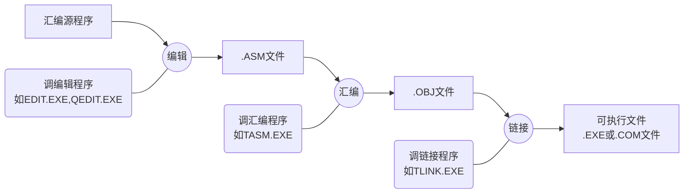

[TOC]


# 微型计算机基础

## 数制

略

## 编码

### 字符编码——ASCII


### BCD码

### 原反补码——有符号数的编码

字长：计算机在同一时间内处理二进制数的位数。是CPU的主要技术指标之一

#### 原反补求补

|      | 正数                      | 负数                                                  |
| ---- | ------------------------- | ----------------------------------------------------- |
| 原码 | 符号位0，数值位表示绝对值 | 符号位1，数值位表示绝对值                             |
| 反码 | 符号位0，数值位表示绝对值 | 符号位1，数值位是绝对值按位取反                       |
| 补码 | 符号位0，数值位表示绝对值 | 符号位1，数值位是绝对值按位取反再加一，符号位参与进位 |

求补：已知[X]~补~，求[-X]~补~。全位取反再加一，符号位参与进位

#### 补码运算

$$
[x+y]_补=[x]_补+[y]_补
\\
[x-y]_补=[x]_补+[-y]_补
$$

-   符号位参与运算
-   以2^n^为模（n为字长）
-   真值满足$-2^{n-1}≤x,y,x+y,x-y<2^{n-1}$

>   例题
>
>   字长=8， [X]~补~=（A5）~16~，则X=（   ）~16~
>
>   提示/注意点：
>
>   看到“补”就知道是表示有符号数，那么实际表示数值的只有7位，而非8位，第一位是符号。在写出原码后，记得第一时间将第一位符号写成+/-（以免将符号位也一同化为16进制数）。将后面7位四位一组化为16进制，不足四位的高位补0补成四位。
>
>   答案：
>
>   -5B

#### CF和OF

CF：进位标识，CF=进位

OF：当两个数符号相同，且与结果符号相异，则置1；否则置0

通常判断是否溢出时

**无符号数**运算看**CF**

**有符号数**运算看**OF**


## 微型计算机系统的基本组成

### 冯诺依曼计算机体系逻辑结构思想


### 微型机硬件结构


以CPU为核心通过3条总线连接存储器、I/O接口，构成微型计算机。以其为主体，配上系统软件和外设，构成微型计算机系统

存储器：指主存或内存

IO接口：是CPU和外部设备交换信息的“中转站”。微型计算机与外设的连接和信息交换必须通过**接口**实现。

总线：总线是CPU与存储器、I/O接口交换信息的公共通道

地址总线：n条能访问2^n^个字节的存储单元

数据总线：n条能一次传输n位数据

控制总线：提供控制信号

### 硬件


### 存储器

存储元：最小单位，存1位（1 bit）

存储单元：若干个存储元

存储体：许多个存储单位

单元地址：存储单元再存储体中的唯一编号

存储器：由 存储体、地址译码电路、读写控制电路 等构成

存储单元的二进制地址码,由CPU通过地址总线送存储器的地址译码器的输入。为了方便，习惯上书写成16进制

分类

按材质分：

按IO分：ROM、RAM

RAM：可读可写。内存、辅存等。

ROM：只读不写。应用：BIOS（基本输入输出系统程序，BIOS是计算机最底层的系统管理程序,操作系统和用户程序均可调用。）


# 80X86微处理器

## 32位微处理器内部结构

### 结构寄存器分类

486内部寄存器分为4类：**基本结构寄存器**、**系统级寄存器**、**调试测试寄存器**、**浮点寄存器**。应用程序只能访问**基本结构寄存器**、**浮点寄存器**

### 基本结构寄存器


#### 通用寄存器


前8个通用寄存器的低16位可以独立使用，分别以（AX,BXCX,DX,SP,BP,DI,SI）命名访问。

其中 AX,BXCX,DX 的共同特点是：低 8 位和高 8 位又可独立使用。低 8 位分别称作 AL,BL,CL,DL，高 8 位分别称作 AH,BH,CH,DH。

指针寄存器，为寻址存储单元提供**偏移地址**


IP，与CS给出地址合成20位指令的内存地址

SP，与SS给出地址合成20位堆栈栈顶单元的物理地址

这几个**除了IP**都能作为数据寄存器使用

#### 标志寄存器


FLAGS又被称为程序状态字PSW。

作用：

1.  记录CPU运行结果状态标志
2.  控制CPU的某种操作

EFLAGS 和FLAGS 的标志位分为状态类和控制类

状态标志：SF，ZF，PF，CF，AF，OF

控制标志：DF，IF，TF

#### 段寄存器


段寄存器都只有16位，用于指示数据和代码所在地址空间（**段基址**）

代码段寄存器：CS

堆栈段寄存器：SS

数据段寄存器：DS，ES，FS，GS

除CS，其他都指示数据的地址空间

## 32位微处理器工作模式

### 存储空间

存储空间：物理、虚拟 、线性

#### 物理空间

即主存空间

486有32条地址线，内存最大容量为4G，地址范围00000000H~FFFFFFFFH

#### 虚拟空间

即编程空间

主存与辅存看作一个整体。空间对应地址称为**虚拟地址**或**逻辑地址**或**编程地址**。运行编程的空间有2^46^，大大超过物理空间。

程序运行时，从虚拟空间取一部分代码载入物理空间运行

#### 线性空间

当程序从虚拟空间调入物理空间时，需要进行**地址转换**，分段部件首先把**虚拟地址**转换为**32位线性地址**


若不分页，则线性地址=物理地址

若分页，则由分页部件将线性地址转化为物理地址

实模式：只分段，不分页；

保护模式：先分段，再分页

### IO空间

利用低16位地址线访问IO端口。IO地址空间不分段

### 工作模式

工作模式有三种：实（地址）模式，保护（虚拟地址）模式，虚拟86模式

#### 实模式

1.  加电、复位之后，486自动工作在实模式，系统受DOS管理;
2.  在实模式下，486只能访问第一个1M内存(00000H~FFFFFH);
3.  存储管理部件对存储器只进行分段管理，没有分页功能，每一逻辑段的最大容量为64K;
4.  在实模式下，段寄存器中存放段基址。

#### 实地址下物理地址形成


代码段
CS\*2^4^+IP=指令单元的物理地址,一条指令的一个字节取出后，IP自动加1，指向下一字节。
堆栈段
SS\*2^4^+SP=栈顶单元的物理地址。

数据段
DS*2^4^+偏移地址=数据单元的物理地址。

代码段
CS、IP的初值：由操作系统赋值

堆栈段
SS、SP的初值：①由程序员赋值②由操作系统自动赋值

数据段
DS/ES/FS/GS的初值：由程序员赋值
BX/SI/DI/BP的初值：由程序员赋值

##### 地址表示形式

物理空间的物理地址：20位

虚拟空间的逻辑地址：段基址:偏移地址（编程时采用逻辑地址）

#### 保护模式

引入保护模式解决了实模式的3个问题：

1.  针对实模式只能访问最底端1MB物理主存地址空间的问题,使之能访问16MB(80286处理器)或4GB(80386及后继处理器)甚至更多物理主存空间。
2.  使系统支持多任务处理功能。多任务处理功能即多个应用程序能同时在同一台计算机上运行,且各程序间相互隔离,以使任一应用程序中的故障或缺陷不会破坏系统,也不会影响其他应用程序的运行。
3.  是使系统支持虚拟存储器。简单地说,虚拟存储器支持程序员编写的程序空间,该空间可比主存所能提供的空间大得多,这样即使主存提供的空间不够大,也能运行程序员编写的程序。80386以上处理器的存储管理及存储保护机制支持了保护模式。

环保护模式：设立特权级（0，1，2，3共4级，数值越低，特权越高）

0级：操作系统的核心

1级、2级：系统服务及接口

3级：应用程序

特权规则：

1.  特权级P存储在某个段上的数据，只能由不低于P级的特权级进行访问。
2.  具有特权级Р的程序或过程只能由在不高于Р级上执行的任务调用。

保护模式特点

1.  使用4级保护，实现多个应用程序和系统程序相互之间的隔离和保护，支持多任务操作系统;
2.  486可以访问4G物理存储空间;
    存储器用虚拟地址空间、线性地址空间和物理地址空间三种方式来进行描述，虚拟地址就是逻辑地址。
    寻址机构不同于8086，通过一种称为描述符表的数据结构来实现对内存单元的访问，该描述符由存放在段寄存器中的选择符来确定。
3.  CPU内部的存储管理部件对存储器采用分段和分页管理。可以将磁盘等存储设备有效映射到内存，使逻辑地址空间大大超过实际的物理地址空间，这样使主存储器容量似乎很大;
4.  能进行16位或32位运算


# 汇编语言指令集

## 概述

符号指令的书写格式

`标号:操作码助记符 操作数助记符(,操作数助记符...);注释`

例如：MOV CH,00H

## 操作数

### 通用寄存器

### 段寄存器和指令指针寄存器

### 标志寄存器

标志寄存器一般不用满所有位

六个标志位及其作用如下：

-   C 标志（进位/借位）：最高位进位/借位，置 1 ；否则置 0
-   O 标志（溢出）：操作数符号相同且与运算结果相异，置 1；否则置 0
-   S 标志（最高位符号）：记录运算结果最高位的位值。最高位为 1 ，置 1；为 0 置 0
-   P 标志（奇偶）：运算结果**最低一字节（最低8位）**中1的个数为偶，置 1 ；否则置 0 
-   A 标志（辅助进位/借位）：16进制下，**D~3~向D~4~**进位/借位，置 1 ；否则置 0
-   Z 标志（全零）：运算结果全零，置 1 ；否则置 0

## 寻址方式

在微型计算机中，操作数可能以以下三种方式存在：

-   操作数包含在指令中——指令的操作数部分就包含着操作数本身。

    ```assembly
             MOV AX, 1234H    
             ADD AL, 2
    ```

-   操作数包含在CPU的某一个内部寄存器中—— 指令中的操作数是CPU内部的某一个寄存器

    ```
    		MOV  DS, AX
    ```

-    操作数在内存的数据区中—— 指令中的操作数包含着此操作数的地址

    ```
    		MOV  AX,DS:[2000H]
    ```

### 立即寻址

操作数包含在指令中。此时操作数也叫立即数。

立即寻址通常用于给寄存器或内存赋值，并且**只能用于源操作数**。

有3种写法：

1.  二进制数加后缀B
2.  十六进制加后缀H
3.  八进制加后缀Q

可以用单引号括起一个字符，汇编后称为对应ASCII码。

可以用表达式作为立即数，计算机会先计算结果再作为实际操作数

### 寄存器寻址

操作数是寄存器名，就叫寄存器寻址

### 存储器操作数寻址

>   CPU在内存读写操作数之前，必须知道物理地址。

存储器操作数寻址的指令格式必须是逻辑地址，即`段基址:偏移地址`。CPU会自己计算对应的物理地址。其中段基址有事先约定的话可以省略

实模式运行下16位寻址

段约定：SP--SS，BX--DS

寄存器操作数寻址中，只有 **BX、BP、SI、DI** 这四个寄存器可以作为间址寄存器，出现在源操作数中

操作数含BP的默认访问堆栈段

| 5种寄存器操作数寻址 | 地址来源                                   | 书写                     |                                                              |
| ------------------- | ------------------------------------------ | ------------------------ | ------------------------------------------------------------ |
| 直接地址            | 操作指令中直接给出偏移值                   | 段寄存器:[12H]           | 很少使用，因为通常情况下不知道准确的偏移地址                 |
|                     | 变量名XX                                   | 段寄存器:XX<br />或XX    | 变量名代表存储单元的有效地址。<br />变量名是唯一的，有段基址和偏移量两种属性 |
| 间接地址            | 间址寄存器                                 | 段寄存器:[BX]            | 段基址+BX里的偏移地址合成20位地址                            |
|                     | BP 约定堆栈段<br />BX , SI , DI 约定数据段 | [BX]                     | 约定段寄存器+BX里的偏移地址合成20位地址                      |
| 基址                | 基址寄存器BX/BP，指令                      | 段寄存器:[BX/BP+n]       | 段基址+BX里的偏移地址+指令中的偏移量合成20位地址             |
|                     | BP 约定堆栈段<br />BX 约定数据段           | [BX/BP+n]                | 约定段基址+基址寄存器偏移地址+指令中的偏移量合成20位地址     |
| 变址                | 变址寄存器SI/DI，指令                      | 段寄存器:[SI/DI+n]       | 段基址+变址寄存器偏移地址+指令中的偏移量合成20位地址         |
|                     | SI , DI 约定数据段                         | [SI/DI+n]                | 约定段基址+变址寄存器偏移地址+指令中的偏移量合成20位地址     |
| 基址加变址          | 基址寄存器BX/BP，变址寄存器SI/DI，指令     | 段寄存器:[BX/BP+SI/DI+n] | 约定段基址+基址寄存器偏移地址+变址寄存器偏移地址+指令中的偏移量合成20位地址 |
|                     |                                            | [BX/BP+SI/DI+n]          | 约定...                                                      |

>   | **间址寄存器**       | **约定访问的逻辑段** |                  |
>   | -------------------- | -------------------- | ---------------- |
>   | **BP**               | **堆栈段**           | **16位寻址方式** |
>   | **BX,SI,DI**         | **数据段**           |                  |
>   | **EBP,ESP**          | **堆栈段**           | **32位寻址方式** |
>   | **EAX～EDX,ESI,EDI** | **数据段**           |                  |

## 汇编语法

### 概述

可执行文件的生成有三步：编辑、汇编、链接



**指令性语句：符号指令**。经汇编后,其目标指令通知CPU进行什么操作

**指示性语句：伪指令，宏指令**。是非机器指令，是在汇编期间进行操作的。为汇编程序，链接程序提供汇编链接信息。

指令性语句格式

| 标号: | 操作码助记符 | 空格 | 操作数助记符（多项用“，”隔开） | ;注释 |
| ----- | ------------ | ---- | ------------------------------ | ----- |

指示性语句格式

| 变量 | 伪指令助记符 | 空格 | 操作数助记符（多项用“，”隔开） | ;注释 |
| ---- | ------------ | ---- | ------------------------------ | ----- |

汇编语言语句的通用格式如下：

| 名字项 | 操作项 | 空格 | 操作数项（多项用“，”隔开） | ;注释 |
| ------ | ------ | ---- | -------------------------- | ----- |


### 常用伪指令（变量定义）

#### 字节定义伪指令

```
N1	DB 	12H,64,-1,3*3
   	DB 	01010101B,‘A’,‘B’
   	DB 	0A6H,‘HELLO’ ;这里的字符串表示将H,E,L,L,O依次存储
N2 	DB 	?,?,?;与下条等价
N2 	DB 	3 DUP(?)
```

DB：Define Byte，定义字节，表示按字节存储

?：表示随机数

DUP：Duplicate(重复)。前面的数字表示重复次数，括号里的参数表示要重复存储的值

#### 字定义伪指令

```
WNUM	DW   1234H,12,‘AB’,‘C’
		DW   ?,?
        DW   2 DUP(?)

```


注意和字节定义的区别：字定义是16位，意味着所有存进去的都是16位，采用小段对其，操作数低位放进低地址位，高位放进高地址位，不足16位的一律高位补0。

#### 双字定义伪指令

```
DNUM   DD   12345678H
```


#### 多字节定义伪指令(了解)

变量名 DF 一串用逗号间隔的6字节数

变量名 DQ  一串用逗号间隔的8字节数

变量名 DT 一串用逗号间隔的10字节数

功能: 通知汇编程序为DF/DQ/DT后跟的每一个数，分配6/8/10个单元。   

### 操作数项

#### 数值表达式

##### 立即数

汇编后立即数均被转化为二进制，负数用补码表示。

十进制数后缀加D（可省略）

二进制加B

十六进制加H，且以A~F开头时必须前缀加0，以免和变量命名混淆。

八进制加Q

##### 字符串常数

字符串常数是用**单引号**括起来的一个或多个字符，汇编后会被转换为对应的ASCII码。

>   字符串'ABC'会被转换为414243H
>
>   字符串'12'会被转换为3132H

##### 符号常数

使用符号定义伪指令`EQU`或`=`定义的常数。

例如 `NUM EQU 15`就将15赋给NUM，之后NUM就是15

EQU和=的区别在于，EQU定义过一次后就不能再更改，而=定义后仍可用=更改。

##### 数值运算符

###### 算术运算符

`+,-,*,/,MOD(模除)`

###### 逻辑运算符

AND与，OR或，XOR异或，NOT非，SHL左移，SHR右移。逻辑运算均为按位操作。

>   MOV AH,2 SHL 1;源操作数2左移1位变成4

###### 关系运算符

EQ相等，NE不等，GT大于，LT小于，GE大于或等于，LE小于或等于

关系运算后若为真，则返回0FFFFH；假，返回0 

另外，关系运算只能对两个数字或位于同一个逻辑段的两个存储单元中的数操作。

>   MOV AX,1000H GT 1234H;结果为0

###### 数值回送运算符

SEG,OFFSET,$等

-   SEG：返回地址的段基址

-   OFFSET：返回地址的偏移地址

-   $：返回本地地址（当前汇编地址）。通常用于计算变量在逻辑段中占用的字节数

    >   BUF DB 'HELLO NJUPT';有11个字符
    >
    >   COUNT EQU $-BUF
    >
    >   则COUNT的值为11

#### 地址表达式

##### PTR运算符

PTR运算符可以暂时修改存储器操作数的类型属性。

使用格式如下：    

| 类型说明符    | 空格 | PTR  | 空格 | 地址表达式          |
| ------------- | ---- | ---- | ---- | ------------------- |
| BYTE（字节）  |      |      |      | 内存单元5种寻址方式 |
| WORD（字）    |      |      |      | 内存单元5种寻址方式 |
| DWORD（双字） |      |      |      | 内存单元5种寻址方式 |
| FAR           |      |      |      | 子程序的名称        |
| NEAR          |      |      |      | 子程序的名称        |

*类型除了上面 5 种，还有FWORD三字 (6 字节),QWORD四字(8 字节),TBYTE(10字节)等等*

以下情况需要使用PTR运算符：

1.  指令的操作数至少有一个类型属性要确定，否则必须用PTR运算符说明其中的内存操作数的类型。
2.  若两个操作数的类型属性都确定，则必须保持一致。否则必须用PTR运算符改变其中的内存操作数的类型，以保持前后属性一致。

类型属性确定的操作数：

1.  寄存器
2.  用变量名直接寻址的内存操作数

类型属性不确定的操作数：

1.  立即数 
2.  直接给出偏移地址的直接寻址的内存操作数  
3.  间址、基址、变址、基址+变址寻址的内存操作数

>   ```
>   BUF   DB	11，22，33，44
>   WBUF  DW   	？，？
>   XX    DB    0FFH，0
>   YY    DB    0FFH，0FFH，0，0
>   Z     DB    0FFH，0FFH，0FFH，0          
>   
>   MOV    AX，WORD PTR BUF    ; AH=22，AL=11
>   MOV    BUF，12H           
>   MOV    WORD PTR BUF,1234H  ;BUF单元为34H,BUF+1单元为12H
>   ```
>
>   

##### 方括号运算符

用方括号括起来的地址表达式是访问内存操作数常用的寻址方式，方括号的另一用途是标注数组元素的下标，下标从0开始。    

类比数组即可


## 80486基本指令集

80486基本指令集分 6 类：

方便起见，用以下字母作替代操作数，字母后面的数字代表操作数位数

-   N 立即数，N8,N16,N32
-   R 寄存器操作数，R8,R16,R32
-   M 内存操作数，M8,M16,M32
-   S 段寄存器

总说明：

对于双操作数指令（如：MOV，ADD，CMP）

-   源、目操作数不可同为内存操作数
-   源、目操作数属性一致（长度相同）
-   当目标操作数为间址、变址、基址、基+变址的内存操作数，而源操作数为单字节/双字节立即数，则目标操作数必须用PTR说明类型

对于单操作数指令（如：INC，DEC）

-   若操作数为间、变、基、基+变的内存操作数，则必须用PTR说明类型

### 传送类指令

传送指令分为 3 类：通用传送指令、堆栈操作指令和[输入输出指令]()。

本类指令执行后，**不影响状态标志**

#### 通用传送指令

##### 数据传送指令MOV

格式：`MOV	目,源`

说明：

1.  立即数不能作为目标操作数

2.  源、目操作数不能同时为内存操作数，也不能同时为段寄存器

3.  不能将立即数传送给段寄存器，若要对段寄存器赋值，需要借助16位通用寄存器中转

    >   MOV	AX,SEG DATA
    >
    >   MOV	DS,AX

4.  源、目操作数类型属性不同时，使用PTR

5.  源操作数是立即数时，若目标操作数字长较大，则会先将立即数转换为等长字长

>   以下都是错误例子：
>
>   MOV DS, 3000H 
>
>   MOV 2000H, AL
>
>   MOV[2000H],[3000H]
>
>   MOV DS, ES

<details>
    <summary style="font-size:20px;">例题</summary>
	1、设数据段:<br>
	BNUM    DB    12H,34H,56H,78H,90H<br>
	WNUM   DW   1122H,3344H,5566H<br>
	DNUM    DD    13572468H,87654321H<br>
	FNUM    DF    112233445566H <br>
	MOV   DS, 数据段段基址	;对DS初始化<br>
	MOV   BL,BNUM	;BL=12H<br>
    <br>
    2、  设数据段:<br>	
    BNUM       DB       12H,34H,56H,78H,90H<br>
    WNUM      DW      1122H,3344H,5566H<br>
    DNUM       DD       13572468H,87654321H<br>
    FNUM        DF        112233445566H <br>
    MOV     DS, 数据段段基址<br>
  	MOV     BX,WNUM+2       ;BX=3344H<br>
    <br>
    3、设数据段:	<br>
    BNUM       DB       12H,34H,56H,78H,90H<br>
    WNUM      DW      1122H,3344H,5566H<br>
    DNUM       DD       13572468H,87654321H<br>
    FNUM        DF        112233445566H <br>
    MOV DS, 数据段段基址<br>
    MOV     EBX,DNUM+4             ;EBX=87654321H<br>
    <br>
    4、设数据段:	<br>
    BNUM       DB       12H,34H,56H,78H,90H<br>
    WNUM      DW      1122H,3344H,5566H<br>
    DNUM       DD       13572468H,87654321H<br>
    FNUM        DF        112233445566H <br>
    MOV DS, 数据段段基址<br>
    MOV   BX, WORD  PTR BNUM+1     ;BX=5634H<br>
    <br>
	5、设数据段:	BNUM       DB       12H,34H,56H,78H,90H<br>
    WNUM      DW      1122H,3344H,5566H<br>
    DNUM       DD       13572468H,87654321H<br>
    FNUM        DF        112233445566H <br>
	MOV    DS, 数据段段基址<br>
	MOV    BX, WORD  PTR  DNUM[ 3 ]  ;BX=BX=2113H<br>
	<br>
	6、设数据段:	<br>
	BNUM       DB       12H,34H,56H,78H,90H<br>
	WNUM      DW      1122H,3344H,5566H<br>
    DNUM       DD       13572468H,87654321H<br>
    FNUM        DF        112233445566H <br>
    MOV     DS, 数据段段基址<br>
    MOV     SI,  OFFSET  BNUM<br>
    MOV     BX,[ SI+1]      ;BX=5634H          <br>  
</details>

##### 偏移地址传送LEA

格式：`LEA	目标操作数,源操作数`

说明：**源操作数只能是内存操作数，目标操作数只能是16位或32位寄存器**

等价于：`MOV  REG,OFFSET SRC`

>   LEA BX,  DS:[100H]
>
>   执行后  BX=100H

##### 交换指令XCHG

格式：`XCHG	目标操作数,源操作数`

说明：源、目操作数只能是寄存器操作数或内存操作数

##### 查表指令XLAT（了解）

格式：`XLAT 表头变量名`

说明：该指令查找数据段中的字节表，即要求数据表放在数据段，每个表元素为单字节数；指令执行前：EBX或BX=表头的有效地址  AL=表元素相对于表头的地址位移量  

#### 堆栈操作指令

先进后出。**SP始终指向栈顶单元**。生长方向始终是高地址向低地址。存放数据时遵循高地址放高位，低地址放低位。每次进出堆栈的数据长度必须是**字或双字（即16位或32位）**

堆栈指针SP的初值决定了堆栈的大小

堆栈段寄存器SS：存放堆栈段段基址

堆栈指针ESP(SP)：存放栈顶单元的偏移地址

SS、ESP(SP)初值：由程序员赋值或DOS系统自动赋值

##### 通用进栈

格式：`PUSH	源操作数`

说明：源操作数除了CS都行。必要时PTR

过程：先将堆栈指针向低地址方向调整，随后将操作数按指针指向从低到高小端对齐存入。

##### 通用出战

格式：`PUSH	源操作数`

说明：目标操作数除了CS都行。必要时PTR

过程：先将操作数按指针指向从低到高小端对齐取出，随后将堆栈指针向高地址方向调整。

##### 数据进栈，出栈过程

★数据进栈过程（以16位操作数进栈为例）


★数据出栈过程（以16位操作数出栈为例）


### 算术运算指令


#### 基本四则运算

##### 加法指令

格式：`ADD	DST,SRC`

操作数：

1.  **源操作数**：立即数、通用寄存器、内存；**目的操作数**：通用寄存器、内存。
2.  源、目**不能同时为内存**；**不能同时为段寄存器**
3.  **类型属性一致**

功能：源操作数➕目标操作数，结果存放到目标操作数中。

标志位：**影响6个状态标志** 

说明：该指令适合**有符号数和无符号数**的运算

##### 带进位的加法指令

格式：`ADC	DST,SRC`

操作数：同[ADD](#加法指令)

功能：源操作数➕目标操作数➕当前进位标志C的值，结果存放到目标操作数中。

标志位：**影响6个状态标志位** 

说明：该指令适合**有符号数和无符号数**的运算

>   例题：
>
>   在内存的First和Second开始的区域中分别存放着2F365H和 5E024 H两个数，要求求其和，并存入Third中。
>
>   
>
>   MOV AX, First
>
>   ADD AX, Second
>
>   MOV Third, AX
>
>   MOV AX, First+2
>
>   ADC AX, Second+2
>
>   MOV Third+2, AX

##### 加1指令

格式：`INC	OPRD`

操作数：操作数为 通用寄存器、内存 (不能是段寄存器或立即数）

标志位：**影响OSPAZ标志，不影响C标志位**

说明：**必须明确操作数的类型属性**

>   N  DB  0FFH, 0FFH , 0 , 0
>
>   MOV BX , OFFSET  N
>
>   INC  [BX]                ;错误代码
>
>   INC   BYTE  PTR [BX]  ;N单元为0
>
>   INC   WORD PTR [BX]   ;N、N+1单元都为0
>
>   INC   DWORD PTR [BX]  ;N、N+1单元都为0且N+2单元为1

##### 减法指令

格式：`SUB	DST,SRC`

操作数：同[ADD](#加法指令)

功能：**目标➖源**，结果送入目标

标志位：**影响6个状态标志位**

##### 带借位减法指令

格式：`SBB	DST,SRC`

操作数：同[ADD](#加法指令)

功能：**目标➖源➖当前C标志的值**，结果送入目标

标志位：**影响6个状态标志位**

##### 减1指令

格式：`DEC	DST`

操作数：同[INC](#加1指令)

功能：自减一

标志位：**影响OSPAZ标志，不影响C标志位**

说明：**必须明确操作数的类型属性**

##### 求补指令

格式：`NEG	DST`

操作数：寄存器或内存

功能：求补（即0-操作数），获得相反数

标志位：**影响6个状态位**

说明：**需要明确类型属性**

##### 比较指令

格式：`CMP	DST,SRC`

操作数：同[ADD](#加法指令)

功能与标志位：目标➖源，**不存结果，但根据结果影响6个状态标志位**

说明：可以和[转移指令](#转移和调用指令)配合使用

##### 无符号乘法

格式：`MUL	SRC`

操作数：**源**：**通用寄存器、内存**；**目标（隐含）**：**DX、AX**

功能：

1.  **字节操作：（AH,AL）（AL）×（SRC）** 目标8位，被乘数默认放在AL中，得到的16位结果放在AX中
2.  **字操作：（DX,AX） （AX）×（SRC）**目标16位，被乘数默认放在AX中，得到的32位结果低位放在AX中，高位放在DX中

标志位：**影响6个状态位**

##### 有符号乘法

格式：`IMUL	SRC`

操作数：**源**：**通用寄存器、内存**；**目标（隐含）**：**DX、AX**

功能：

1.  **字节操作：（AH,AL）（AL）×（SRC）** 
2.  **字操作：（DX,AX） （AX）×（SRC）**

标志位：**影响6个状态位**

>   例题
>
>   求 B4H*11H
>
>   **MOV AL, 0B4H**
>
>   **MOV BL, 11H**
>
>   **MUL BL**

##### 无符号除法与有符号除法

格式：

1.  无符号`DIV	SRC`
2.  有符号`IDIV SRC`

操作数：**源**：**通用寄存器、内存**；**目标（隐含）**：**DX、AX**

功能：

1.  字节操作：  **(AL)**    **(AX) / (SRC) ——** **商** **(AH)  **

    ​                     **(AX) / (SRC) ——** **余数**

2.  字操作：**(AX)   (DX,AX) / (SRC) ——** **商**

    ​                **(DX)   (DX,AX) / (SRC) ——** **余数**

标志位：**对各标志位均无定义** 

说明：**SRC的类型决定是字或字节相除**

##### 十进制调整指令

有时会用**BCD码**进行十进制运算，这时就需要十进制调整指令

BCD码数分两种：

-   组合BCD码数（压缩BCD码数）：四位二进制表示一位十进制
-   未组合BCD码数（未压缩BCD码数）：出于存储读取方便，八位二进制（一字节）表示一位十进制

调整原理：

每逢进位、出现非法码时，在对应的那四位上加6（0110H）

>   | 笔算                                                         | CPU运算                                                      | 加法调整                                                |
>   | ------------------------------------------------------------ | ------------------------------------------------------------ | ------------------------------------------------------- |
>   |  |  | C标=0,A标=0,高低四位均没有出现非法BCD码,结果正确,不修正 |
>   |  |  | 低四位有进位,即A标=1,对运算结果加06H修正                |
>   |  |  | 高四位出现非法BCD码数,对运算结果加60H修正               |
>   |  |  | 因为C标=1,低四位出现非法BCD码,对运算结果加66H修正       |

>   例题
>
>   计算1234+5678=？
>
>   **方法一：二进制字节加**
>
>   **数据段：**
>
>      **N1   DW  1234**
>
>      **N2   DW  5678**
>
>      **SUM DW  ?**
>
>   **代码段：**
>
>     **MOV   AL ,  BYTE  PTR N1**
>
>     **ADD   AL  ,  BYTE  PTR N2**
>
>     **MOV  BYTE PTR SUM  ,  AL**
>
>     **MOV  AL ,  BYTE  PTR N1+1**
>
>     **ADC   AL ,  BYTE  PTR N2+1**
>
>     **MOV  BYTE PTR SUM+1  ,  AL**
>
>   **方法二：十进制字节加**
>
>   **数据段：**
>
>      **N1   DW  1234H**
>
>      **N2   DW  5678H**
>
>      **SUM DW  ?**
>
>   **代码段：**
>
>     **MOV   AL ,  BYTE  PTR N1**
>
>     **ADD   AL  ,  BYTE  PTR N2**
>
>     **DAA**
>
>     **MOV  BYTE PTR SUM  ,  AL**
>
>     **MOV  AL ,  BYTE  PTR N1+1**
>
>     **ADC   AL ,  BYTE  PTR N2+1**
>
>     **DAA**
>
>     **MOV  BYTE PTR SUM+1  ,  AL**
>
>   **方法三：二进制字加**
>
>   **数据段：**
>
>      **N1   DW  1234**
>
>      **N2   DW  5678**
>
>      **SUM DW  ?**
>
>   **代码段：**
>
>     **MOV   AX ,  N1**
>
>     **ADD   AX  ,  N2**
>
>     **MOV  SUM  ,  AX**

### 转移和调用指令

转移类指令分类：

-   按照转移条件分：**无条件转移**和**有条件转移**
-   按照转移范围分：**段内转移**和**段间转移**
-   按照获取转移地址的方法分：**直接转移**和**间接转移**

#### 无条件段内直接转移

格式：`JMP	<Address>`Address（通常是代码的标号）

>   ​			**MOV AL, BL**         
>
>   ​       	**CMP AL, 0**
>
>   ​       	**JNS** **pdata**
>
>   ​       	**MOV DS:[1000], AL**
>
>   ​       	**JMP next**
>
>   **pdata: MOV DS:[2000], AL**
>
>   **next: …**

#### 有条件段内直接转移

根据上一条指令影响的状态位来判断是否转移

特点：

1.  **条件转移指令全部为段内转移**
2.  **目标地址在当前指令的** **-128~127** **范围内。**
3.  **目标地址由操作数OPRD确定**
4.  **条件转移指令不影响标志位。**

##### 根据单个条件标志的设置情况转移

| **指令**        | **功能**                 | **转移条件** |
| --------------- | ------------------------ | ------------ |
| JZ / JE  OPRD   | 结果为0 / 相等则转移     | Z=1          |
| JNZ / JNE  OPRD | 结果不为0 / 不相等则转移 | Z=0          |
| JS   OPRD       | 结果为负则转移           | S=1          |
| JNS   OPRD      | 结果不为负则转移         | S=0          |
| JO   OPRD       | 溢出则转移               | O=1          |
| JNO   OPRD      | 不溢出则转移             | O=0          |
| JP / JPE OPRD   | 奇偶位为1则转移          | P=1          |
| JNP / JPO OPRD  | 奇偶位为0则转移          | P=0          |
| JCXZ   OPRD     | CX=0 则转移              | CX=0         |

##### 根据组合条件标志的设置情况转移 

**无符号数大小的比较**

| **指令**   | **目标与源大小关系判断** | **转移条件** |
| ---------- | ------------------------ | ------------ |
| JC   OPRD  | ＜                       | C=1          |
| JNC   OPRD | ≥                        | C=0          |
| JNA   OPRD | ≤                        | C∨Z=1        |
| JA   OPRD  | ＞                       | C∨Z=0        |

**带符号数大小的比较**

| **指令**   | **目标与源大小关系判断** | **转移条件** |
| ---------- | ------------------------ | ------------ |
| JL    OPRD | ＜                       | S⊕O=1 且 Z=0 |
| JGE   OPRD | ≥                        | S⊕O=0 或 Z=1 |
| JLE   OPRD | ≤                        | S⊕O=1 或 Z=1 |
| JG    OPRD | ＞                       | S⊕O=0 且 Z=0 |

>   例：两无符号数相加，结果正确则AX中存入1，若溢出则AX中存入0。
>
>   ​		**MOV AX, X**
>
>   ​        **MOV BX, Y**
>
>   ​        **ADD BX, AX**
>
>   ​        **JC ERROR**
>
>   ​         **MOV AX, 1**
>
>   ​         **JMP EXIT**
>
>   **ERROR : MOV AX, 0**
>
>     **EXIT:  MOV AH, 4CH**
>
>   ​         	**INT 21H**
>
>   例3：有一组无符号数，与50比较，大于50 的存入另一存储区， 小于或等于50的放弃。
>
>   ​		**LEA SI, array1** 
>
>   ​       	**LEA DI, array2** 
>
>   ​       	**MOV CX, n**
>
>   **Again: MOV AL,[SI]**
>
>   ​       	**CMP AL, 50**
>
>   ​       	**JNA next** 
>
>   ​       	**MOV [DI], AL**
>
>   ​       	**INC DI**
>
>     **next: INC SI**
>
>   ​       	**LOOP Again**

#### 循环指令

格式：`LOOP	<OPRD>`

| **指令**             | **功能**                   | **循环条件**   |
| -------------------- | -------------------------- | -------------- |
| LOOP   OPRD          | 计数器不为零循环           | CX$\neq$0      |
| LOOPZ / LOOPE OPRD   | 计数器不为零且相等时循环   | CX$\neq$0且Z=1 |
| LOOPNZ / LOOPNE OPRD | 计数器不为零且不相等时循环 | CX$\neq$0且Z=0 |


>   例：数出长度为10的，以STRING为首地址的字符串中空格的个数。
>
>   ​           **LEA  SI, STRING**
>
>   ​         **MOV CX, 0AH**
>
>   ​         **MOV AL, 20H    ;** **空格的ASCII码为20H**
>
>   ​         **MOV AH, 0H     ;** **结果在AH中**
>
>   **AGAIN:  CMP AL, [SI]**
>
>   ​         **JZ ADDA**
>
>   ​         **JMP CONT**
>
>    **ADDA:  INC AH**
>
>    **CONT:  INC SI**
>
>   ​         **LOOP AGAIN**

#### 子程序调用及返回指令

格式：

父亲程序：`CALL <Address>`
子程序：`RET`

`CALL <Address>`调用：调用子程序，即无条件转到子程序的第一条指令

`RET`返回：子程序返回断点，即返回到CALL的后继指令

子程序：能完成一定功能的相对独立的程序段

##### 过程（子程序）定义

格式：

```
<过程名>	PROC	<属性>
	<子程序实体>
	RET
<过程名>	ENDP
```

说明：

-   过程名：子程序名，以字母开头，长度≤31
-   经汇编之后，过程名就是子程序第一条指令的地址。
-   PROC/ENDP 是子程序的定界语句
-   <属性> 有2种描述：
    -   NEAR(可缺省)代表近过程，即该子程序和调用它的那条指令在同一个代码段
    -   FAR 代表远过程，即该子程序和调用它的那条指令不在同一个代码段
-   RET子程序返回指令


##### 断点保存

由于执行完子程序后还要回到父程序，所以需要利用**堆栈**保存父程序断点地址。

段内调用：**CALL** 标号   

   **(SP)**←**(SP)-2**

   **(SP)+1, (SP)**  ←**(IP)**

   **(IP)** ← **调用地址**

 **段内返回：** **RET**

   **IP** ←**(SP)+1, (SP)**

   **(SP) ← (SP)+2**

##### 子程序返回参数

在调用子程序时，有时需要传递参数，一种方式是主程序将参数压栈，以便子程序调用。

而子程序返回后，该参数即无用，若留在堆栈中则占用堆栈空间，故用**RET EXP **指令将其释放。

例如：`RET 6`表示释放堆栈中6个字节的空间

### 逻辑运算和移位指令

#### 逻辑运算指令

| 指令 | 格式           | 功能                                             | 操作数               | 标志位                           |
| ---- | -------------- | ------------------------------------------------ | -------------------- | -------------------------------- |
| 取反 | `NOT DST`      | 目标操作数**按位取反**                           | 寄存器、内存（PTR）  | 不影响6个状态位                  |
| 与   | `AND DST,SRC`  | 目标与源**按位与**，结果送入目标                 | 源、目：寄存器、内存 | C、O置0<br/>根据结果设置S、P、Z  |
| 或   | `OR DST,SRC`   | 目标与源**按位或**，结果送入目标                 | 源、目：寄存器、内存 | C、O置0<br/>根据结果设置S、P、Z  |
| 异或 | `XOR DST,SRC`  | 目标与源**按位异或**，结果送入目标               | 源、目：寄存器、内存 | C、O置0 <br/>根据结果设置S、P、Z |
| 测试 | `TEST DST,SRC` | 目标与源**按位与**，**不改变目标与源**，只改标志 | 源、目：寄存器、内存 | C、O置0 <br/>根据结果设置S、P、Z |

这是异或法则：

$0\oplus0=0\\ 1\oplus0=1\\ 0\oplus1=1\\ 1\oplus1=0 $

可以看出，原数异或0后，不发生变化；原数异或1后取反了，简称 **0 不变，1 取反**。利用这一特性实现**某几位取反，而其它位不变**。

例如，前三位不变，后五位取反，则异或 00011111。

#### 移位指令

移位指令共通点：移出来的那位一定会赋值给CF。

标志位影响：

-   CF
-   OF（仅在移位次数为1时受影响：移位后最高位变化，则置1；否则置0）
-   开环移位指令根据结果设定S、P、Z；闭环移位指令不影响S、P、Z
-   A未定义

##### 开环移位（一般移位）

**开环移位指令根据结果设定S、P、Z**

###### 算术左/右移（适用于有符号数）

| 指令                                                         | 格式          | 功能                                                         | 操作数                                                     | 标志位                                                       |
| ------------------------------------------------------------ | ------------- | ------------------------------------------------------------ | ---------------------------------------------------------- | ------------------------------------------------------------ |
| 算术左移<br/> | `SAL DST,CNT` | 移出位赋值给CF，<br/>缺位补0                                 | DST：寄存器、内存（PTR）<br/>CNT移位次数：立即数、CL寄存器 | CF<br/>OF（仅在移位次数为1时受影响：<br/>移位后最高位变化，则置1；<br/>否则置0）<br/>根据结果设定S、P、Z |
| 算术右移<br/> | `SAR DST,CNT` | 移出位赋值给CF，<br/>缺位（最高位）等于原来最高位，即保持符号不变 | DST：寄存器、内存（PTR）<br/>CNT：立即数、CL寄存器         | 同上                                                         |

###### 逻辑左/右移

| 指令                                                         | 格式          | 功能                         | 操作数                                                       | 标志位                                                       |
| ------------------------------------------------------------ | ------------- | ---------------------------- | ------------------------------------------------------------ | ------------------------------------------------------------ |
| 逻辑左移<br/> | `SHL DST,CNT` | 移出位赋值给CF，<br/>缺位补0 | DST目标：寄存器、内存（PTR）<br/>CNT移位次数：立即数、CL寄存器 | CF<br/>OF（仅在移位次数为1时受影响：<br/>移位后最高位变化，则置1；<br/>否则置0）<br/>根据结果设定S、P、Z |
| 逻辑右移<br/> | `SHR DST,CNT` | 同上                         | DST：寄存器、内存（PTR）<br/>CNT：立即数、CL寄存器           | 同上                                                         |

这里特别提一下关于算术左移和逻辑左移的问题。细心的你会发现，左移是直接整体向左移动，右边补零的。如果左移变号了，那左移岂不是不符合乘2^n^了吗？以左移一位为例，其实可以这么理解：如果左移发生了变号，那么就说明本次左移一定发生了溢出（可以自己验算一下），怎么移都是错的。所以就顺其自然，索性整体移动得了。

##### 闭环移位（循环移位）

**闭环移位指令不影响S、P、Z**

###### 不含进位循环移位

小循环，CF只记录，不参与循环

| 指令                                                         | 格式          | 功能                 | 操作数                                                       | 标志位                                                       |
| ------------------------------------------------------------ | ------------- | -------------------- | ------------------------------------------------------------ | ------------------------------------------------------------ |
| 不含进位循环左移<br/> | `ROL DST,CNT` | 移出位赋值给CF和缺位 | DST目标：寄存器、内存（PTR）<br/>CNT移位次数：立即数、CL寄存器 | CF<br/>OF（仅在移位次数为1时受影响：<br/>移位后最高位变化，则置1；<br/>否则置0）<br/>不影响S、P、Z |
| 不含进位循环右移<br/> | `ROR DST,CNT` | 同上                 | DST：寄存器、内存（PTR）<br/>CNT：立即数、CL寄存器           | 同上                                                         |


###### 含进位循环移位

大循环，CF除记录外，参与循环

| 指令                                                         | 格式          | 功能                               | 操作数                                                       | 标志位                                                       |
| ------------------------------------------------------------ | ------------- | ---------------------------------- | ------------------------------------------------------------ | ------------------------------------------------------------ |
| 含进位循环左移<br/> | `RCL DST,CNT` | ①CF赋值给缺位<br />②移出位赋值给CF | DST目标：寄存器、内存（PTR）<br/>CNT移位次数：立即数、CL寄存器 | CF<br/>OF（仅在移位次数为1时受影响：<br/>移位后最高位变化，则置1；<br/>否则置0）<br/>不影响S、P、Z |
| 含进位循环右移<br/> | `RCR DST,CNT` | 同上                               | DST：寄存器、内存（PTR）<br/>CNT：立即数、CL寄存器           | 同上                                                         |


### 串操作指令

### 处理机控制指令

标志处理指令

| **名称**          | **格式** | **功能（对标志位的影响）** |
| ----------------- | -------- | -------------------------- |
| 进位标志清 0 指令 | CLC      | C = 0                      |
| 进位标志置 1 指令 | STC      | C = 1                      |
| 进位标志取反      | CMC      | C=C                        |
| 方向标志清 0 指令 | CLD      | D = 0                      |
| 方向标志置 1 指令 | STD      | D = 1                      |
| 中断标志清 0 指令 | CLI      | I = 0                      |
| 中断标志置 1 指令 | STI      | I = 1                      |
|                   | NOP      | 无，使CPU空转，起延时效果  |


# 汇编语言程序设计

## 汇编语言程序结构

**1.** **方式（处理器）选择伪指令**

**2.** **段定义语句**

**3.** **段约定语句**

**4.** **过程定义语句**

**5.** **汇编结束语句**

**6.返回DOS语句**

```
.586 ;处理器选择
DATA SEGMENT USE16 ;可定义多个数据段
...
DATA ENDS
EDATA SEGMENT USE16 ;可省，可定义多个附加段
...
EDATA ENDS
STACK SEGMENT STACK 'STACK' USE16 ;可省，定义堆栈
...
STACK ENDS
CODE SEGMENT USE16 ;代码段
	 ASSUME CS:CODE,DS:DATA,SS:STACK,ES:EDATA ;段约定
BEG:MOV AX,DATA ;DS初始化
	MOV DS,AX
	MOV AX,EDATA ;ES初始化（如果有的话）
	MOV ES,AX
	... ;
	MOV AH,4CH ;返回DOS
	INT 21H
P1 PROC ;定义子过程
   ...
   RET
P1 ENDP
CODE ENDS
END BEG ;编辑结束
```

### 处理器伪指令

不同的CPU有不同的指令集，所以开头要选择处理器。一般用`.486`或`.586`

### 段定义伪指令

段定义伪指令用于定义逻辑段，比如数据段、堆栈段、代码段等。

格式：

```
段名 SEGMENT 定位参数 链接参数 '分类名' 段长度
    段体
段名 ENDS
```

定位参数，链接参数，‘分类名’ 为段定义语句的3个属性参数,可以选用1～3个,也可以全部省略（**定义堆栈段时要全写**）。

#### 定位参数

定位参数通知链接程序,逻辑段的目标代码在存储器中如何存放。

1.  BTYE 字节地址：表明该逻辑段的目标代码可以从任意地址开始依次存放
2.  WORD 字地址：表示该逻辑段的目标代码,从偶地址开始依次存放
3.  PARA (或者缺省) 节地址：表示该逻辑段的目标代码,从一个能被16整除的地址开始依次存放
4.  PAGE 页地址：表示该逻辑段的目标代码,从一个能被256整除的地址开始依次存放。

>   链接程序对于不同模块中的同名段进行链接时,对于有BYTE属性的段,总是紧接着前一段存放,不留空闲单元。对于有WORD属性的段,也是紧接前一段存放,最多留出一个空闲单元。

#### 链接参数

链接又称组合，链接参数通知链接程序如何将不同模块中的同名逻辑段组合成一个段。

  ① PUBLIC：通知链接程序,把不同模块中具有PUBLIC属性的同名段,在满足定位方式前提下,按照指定的链接顺序进行链接,组成一个逻辑段;

  ② MEMORY：实验证明 MEMORY属性和 PUBLIC属性是等价的;

  ③ COMMON：通知链接程序,把不同模块中,具有 COMMON 属性的同名段,根据指定的链接顺序,按照 “覆盖” 方式组合成一个逻辑段。组合之后的逻辑段体积,等于链接之前具有 COMMON 属性同名段中最大的段体;

  ④ STACK： 具有STACK属性的逻辑段是堆栈段,链接程序将把不同模块中具有STACK属性的同名段链接成一个大的堆栈段。链接后的堆栈空间是链接前各模块预留的堆栈空间之和。

 程序装入后,DOS自动给SS寄存器赋值,使之等于堆栈段段基址,自动给SP赋值,使之等于堆栈空间的字节数,使 SS:SP自动指向栈顶。

 链接程序要求:EXE文件的汇编源程序,必须有堆栈段,否则链接时发出警告信息:

​    Warning no stack segment

这行信息仅仅是提醒用户注意,并不表示源程序有什么错误。

⑤ AT 表达式： 该属性表明:逻辑段在定位时,其段基址等于表达式给出的值。AT属性常和 ORG伪指令配合

 如: DATA    SEGMENT AT 0040H

​              ORG   0017H

   KEYFLAG  DB   ？

   DATA      ENDS

 定义键标志单元(KEYFLAG)的物理地址为00417H,以便代码段中可以使用变量名KEYFLAG访问这个单元。

 AT 参数不能使用在代码段。

⑥ 缺省:表明该段是一个独立的逻辑段,链接程序对于不同模块中,链接参数缺省的同名段,不进行组合。

注意：

**模块化程序设计中才用到链接参数**，所以一般不用写。

#### 分类名

表示逻辑段的类别。链接程序把不同模块中分类名相同的同名段组织成一类,存放在邻近的存储区中

由用户定义,是长度不超过40个字符的字符串。

 分类名必须用单引号括起来,分类名可有可无。

 习惯上,数据段分类名用’DATA’,代码段分类名用’CODE’,堆栈段分类名用 ‘STACK’。

#### 段长度

这一参数是80386、80486汇编语言新增的段参数,只有高版本的汇编器才能识别,它有两种描述方式可供选择：

1.  USE16：表示该逻辑段长度最大允许为64K,单元的有效地址为16位,访问该逻辑段应采用16位寻址方式。
2.  USE32：表示该逻辑段长度可以超过64K,单元的有效地址为32位,访问该逻辑段采用32位寻址方式。

#### 小结

  1. 段定义语句有4个属性参数,每一个参数都有多种选择。

  2. 模块化程序中才有必要考虑各模块之间同名段的定位方式和链接方式。对于单一模块的程序不需考虑这些问题。

  3. 单一模块的程序,如果有堆栈段的话,堆栈段的链接属性应为 STACK(因为只有STACK属性才表示该段是堆栈段),分类名应为用’STACK’，且不能省略。其它的逻辑段,前3个属性参数都选用缺省方式。

  4. 不同模块中,链接方式相同的同名段,如果有‘分类名’的话,‘分类名’必须相同。

5.   DOS环境下运行的程序选用USE16做段长度。

### 段约定语句

格式：`ASSUME  段寄存器:段名,……,段寄存器:段名`

功能：ASSUME 语句通知汇编程序，寻址逻辑段使用哪一个段寄存器。

### 过程定义语句

“过程”即“子程序”。子程序必须用RET作为返回指令，用过程定义语句为子程序定界

### 汇编结束语句

格式1：`END 程序的启动地址标号`

 功能 ： 通知汇编程序,源程序到此结束,用BEGIN作标号的指令是程序的启动指令。

>   DOS装载程序的可执行文件(EXE文件)时，自动把标号BEGIN所在段的段基址赋给CS，把BEGIN所在单元的偏移量赋给IP。从而CPU自动从BEGIN开始的那条指令依次执行程序。

 **注意 ：在单一模块的源程序中，以及在模块化程序的主模块中必须用此格式作为源程序的最后一条语句。**

格式2：`END`

功能 ： 通知汇编程序,源程序到此结束。在模块化程序的子模块中,必须用此格式作为源程序的最后一条语句。

>   **结束语句有三种：**
>
>   段结束  （SEGMENT/ENDS）
>
>   过程结束（PROC/ENDP）
>
>   汇编结束（END）

### 返回DOS语句

程序在完成预定任务之后，必须返回DOS。返回DOS最常用的方法是使用DOS系统4CH功能调用，即连续执行以下2条（或3条）指令：

```
MOV    AH,4CH
MOV    AL,返回码   ; 不准备组织批处理文件,此条可省
INT    21H
```

## 源程序的编程格式

汇编源程序有两种编程格式：

-   EXE文件的编程格式：只能生成扩展名为EXE的可执行文件；
-   COM文件的编程格式：可以生成扩展名为COM的可执行文件。

COM文件的执行级别高于EXE文件，同名的BAT(批处理)文件执行级别最低。

### EXE文件的编程格式

此格式允许源程序使用**多个逻辑段**（包括数据段、堆栈段、代码段及其它逻辑段）；

在实模式下,**每个逻辑段的目标块不超过64K**；

适合编写大型程序。

### COM文件的编程格式

源程序**只允许使用一个逻辑段，即代码段，不允许设置堆栈段**;

程序使用的数据,可以集中设置在代码段的开始或未尾;

**在代码段偏移地址(有效地址)为100H的单元，必须是程序的启动指令**;

代码段目标块小于64K。

COM文件的编程格式适合于编写中小型程序。

## 系统功能调用

>   DOS的4个组成部分中IBMBIO.COM和IBMDOS.COM是DOS系统的核心模块。
>
>   IBMBIO.COM为基本I/O设备处理程序,与BIOS一起完成数据输入和数据输出的基本操作。BIOS：一片大容量的EPROM或FLASH存储器。
>
>   IBMDOS.COM是磁盘文件管理程序。
>
>   这两个模块均有若干子功能可以被用户程序调用，称为“DOS功能调用”和“BIOS功能调用”(系统功能调用)


### DOS功能调用

调用格式如下：

```
MOV   AH,功能号
设置入口参数
INT   21H  ;下面几个DOS功能的中断类型码都是21H
分析出口参数
```

功能号： 代表一个不同功能的子程序

其中INT n为软中断指令,n为中断类型码,不同n的代表不同的设备驱动程序。


| 功能号 | 功能                                                         | 入口参数                                                    | 出口参数                                                     |
| ------ | ------------------------------------------------------------ | ----------------------------------------------------------- | ------------------------------------------------------------ |
| 01H    | 等待键入一个字符，有回显，响应Ctrl_C                         | 无                                                          | AL＝按键的ASCII码。若AL＝0,表明按键是功能键,光标键,需再次调用本功能,才能返回按键的扩展码 |
| 02H    | 显示一个字符，响应Ctrl_C<br />该功能要破坏AL寄存器的内容     | DL＝待显字符的ASCII码                                       | 无                                                           |
| 09H    | 从屏幕当前位置开始显示字符串,遇到结束标志\$时停止，\$字符并不显示 | DS:DX＝字符串首地址,字符串必须以‘$'(即ASCII码24H)为结束标志 | 无                                                           |
| 0AH    | 等待键入一串字符送用户程序数据缓冲区                         | DS:DX指向放键入字符的缓冲区                                 |                                                              |
| 4CH    | 结束正在运行的程序，并返回DOS                                | AL=返回码（可省）                                           | 无                                                           |

0AH入口参数缓冲区定义形式规定为：

```assembly
EG：   
BUF		DB   100
       	DB   ？
       DB   100 DUP(?)
```


出口参数：存放于缓冲区的字符串，以回车键结尾

注意：缓冲区定义的第二个字节由系统设置，其余由用户定义；若输入的字节数少于定义的字节数，缓冲区其余字节补零；若输入的字节数大于定义的字节数，后来输入的字符丢弃且响铃警告。

>   例： 人机会话程序 
>
>   要求：
>
>   | 程序和用户交互过程  | 解释                       |
>   | ------------------- | -------------------------- |
>   | what is your name？ | 程序给出的询问信息         |
>   | Li Nei              | 用户回答                   |
>   | Li nei？(Y/N)       | 程序复制用户回答并请求确认 |
>   | N                   | 不确认                     |
>   | what is your name？ | 再次询问                   |
>   | Li Mei              | 用户回答                   |
>   | Li Mei？            | 程序复制用户回答并请求确认 |
>   | Y                   | 用户确认，则程序返回DOS    |
>
>   程序代码清单：
>
>   ```
>   .486
>   DATA   SEGMENT USE16   
>   MESG1  DB	0DH,0AH
>           DB   ‘What is your name ?$’
>   MESG2  DB   ‘?(Y/N)$’
>   BUF    DB   30
>           DB   ?
>           DB   30 DUP(?)
>   DATA   ENDS
>   
>   CODE  SEGMENT USE16
>   ASSUME CS:CODE,DS:DATA
>   BEG:  MOV   AX, SEG DATA
>          MOV   DS,AX
>   AGAIN: MOV   AH,9
>          MOV   DX,OFFSET MESG1
>          INT   21H   ;询问姓名
>          MOV   AH,0AH
>          MOV   DX,OFFSET BUF
>          INT   21H  ;接收键入字符串
>          MOV   BL,BUF+1
>          MOV   BH,0 
>               ;实际键入的字符个数BX
>          MOV   SI,OFFSET BUF+2 
>          MOV   BYTE PTR[BX+SI],‘$’  
>               ;用 ‘$’作为串结束符
>          MOV   AH,2
>          MOV   DL,0AH
>          INT   21H   ;光标下移一行
>          MOV   AH,9
>          MOV   DX,OFFSET BUF+2
>          INT   21H  ;复制键入的字符串
>          MOV   AH,9
>          MOV   DX,OFFSET  MESG2
>          INT   21H    ;给出认可信息
>          MOV   AH,1  
>          INT   21H    ;等待键入
>          CMP   AL,‘Y’;比较
>          JNE   AGAIN
>          MOV   AH,4CH
>          INT   21H      ;返回 DOS
>   CODE   ENDS 
>   END   BEG 
>   
>   ```
>
>   

### BIOS功能调用

```assembly
MOV   AH,功能号
设置入口参数
INT   n ;中断类型码，键盘输入功能为16H，屏幕显示功能为10H
分析出口参数
```

| 键盘输入功能号 | 功能                                   | 入口参数 | 出口参数                                                     | 中断类型码 |
| -------------- | -------------------------------------- | -------- | ------------------------------------------------------------ | ---------- |
| 00H            | 读取输入的一个字符，无回显，响应Ctrl_C | 无       | AL=输入字符的ASCII码。若AL=0，则AH=输入键的扩展码            | 16H        |
| 01H            | 查询键盘缓冲区                         | 无       | ①Z标=0，表示有输入，键代码仍留在键盘缓冲区内。此时AL=输入字符的ASCII码，AH=输入字符的扩展码<br />②Z标=1，表示无输入 | 16H        |


## 常用的代码片段

### 显示二进制数

采用不断左移的方式，将BX寄存器的内容以二进制数格式显在屏幕上


```assembly
.486
CODE   SEGMENT  USE16
       ASSUME   CS:CODE
BEG:   MOV    	BX,5678H
       MOV    CX,16
LAST:  MOV     	DL,’0’
       ROL      BX,1
       JNC      NEXT
       MOV     	DL,’1’
NEXT:  MOV    	AH,2H
       INT      21H
       LOOP   	LAST
       MOV    	AH,4CH
       INT      21H
CODE   ENDS
       END    	BEG                

```

### 二重循环

```
DELAY   PROC
		PUSH  	AX
		PUSH  	DX
    	MOV		DX, 3FFH
TIME1:	MOV  	AX, 0FFFFH
TIME2:  DEC  	AX
        NOP
        JNE  	TIME2
        DEC  	DX
        JNE  	TIME1
        POP  	DX
        POP  	AX
        RET
DELAY   ENDP

```

### 从字符串中找最大数


```
;方法一：统计字符串长度
.486 
DATA SEGMENT USE16
    	BUF   DB	'QWERTYUIOP123'
    	COUNT EQU $-BUF;统计串长度
    	MAX   DB	'MAX=',?,0DH,0AH,'$'
DATA ENDS
CODE SEGMENT USE16
		ASSUME  CS:CODE,DS:DATA
BEG:    MOV   AX,DATA
        MOV   DS,AX
        MOV   AL,0     ;无符号最小数 0 →AL
        LEA   BX,BUF   ;串首址偏移量→BX  
        MOV   CX,COUNT ;串长度→CX  
LAST: 	CMP   [BX],AL;比较
		JC 	  NEXT
        MOV   AL,[BX];大数→AL
NEXT: 	INC   BX
		LOOP  LAST       ;循环计数
        MOV   MAX+4,AL  ;最大数→MAX+4 单元
        MOV   AH,9
        MOV   DX,OFFSET MAX
        INT   21H      ;显示结果
        MOV   AH,4CH
        INT   21H      ;返回 DOS
CODE  ENDS
		END   BEG  

;方法二：在字符串最后加个结束标志
.486
DATA SEGMENT USE16
		BUF    DB    'QWERTYUIOP123'
		FLAG   DB     －1 ;设置串结束标志
		MAX    DB    'MAX=',?,0DH,0AH,'$'
DATA ENDS
CODE SEGMENT USE16  
		ASSUME  CS:CODE,DS:DATA
BEG:	MOV	AX,DATA
		MOV DS,AX
        MOV AL,0    ;无符号最小数 0 →AL
        LEA BX,BUF  ;串首址偏移量→BX
LAST: 	CMP BYTE PTR [BX], -1 ;[BX]=串结束标志 ?
        JE  DISP   ;是,转
        CMP [BX],AL
        JC  NEXT
        MOV AL,[BX]  ;大数→AL
NEXT:   INC BX
        JMP LAST
DISP:   MOV MAX+4,AL ;最大数→MAX+4 单元
        MOV AH,9
        MOV DX,OFFSET MAX
        INT 21H    ;显示结果
        MOV AH,4CH
        INT 21H    ;返回 DOS
CODE ENDS
		END BEG  

```

### 子程序与宏指令

首先明确一点，子程序是另一段程序，宏指令是一段指令的“缩写”，在编译时，宏指令会被直接替换为对应的代码。

共同点： 

-   宏指令与子程序都可以简化程序设计,增强程序的可读性

不同点：

-   子程序调用是由CPU完成的,宏指令调用是在汇编过程中由汇编程序完成的
-   子程序可以缩小目标程序的代码体积，但宏指令不能。

*相对而言，还是宏指令用的多一些*

子程序一般定义在代码段的末尾

#### 子程序

子程序:相对独立的程序，当程序中要多次完成某一操作时，为了简化整体程序，增强程序可读性，常常把“完成某一操作”设计成一个子程序，供调用。

① 子程序用PROC/ENDP定界

② 子程序分为：段内子程序、段间子程序、无参数子程序、有参数子程序

③ 在子程序设计中

• 要明确地定义出这个子程序的入口参数和出口参数，使调用者能方便地使 用子程序。

• 在子程序中合理地保存主程序和子程序都用到的寄存器和存储单元，以使主程序能正确地运行。

参数传送主要有三种方式：

1.  利用寄存器传送参数
2.  利用堆栈传送参数
3.  利用某个内存单元传送参数

#### 宏指令

无参数宏指令的定义语句格式：

```
宏指令名称 MACRO
	宏体
ENDM

```

有参数宏指令的定义语句格式：

```
宏指令名称 MACRO 哑元表
	宏体
ENDM

```

哑元是没有值的符号,用它(们)代表宏体中出现的操作码助记符、操作数

调用时,宏指令行要有和哑元一一对应的实元表。实元：**立即数**、**寄存器操作数**、**没有PTR的内存操作数**

>   如果宏体中有分支、循环,必然有标号,两次以上调用这样的宏指令必然出现标号重复定义的错误。怎么解决？

使用`Local 标号,[标号,...]`

说明:

1.  LOCAL伪指令要放在宏定义之中，是MACRO定界语句以下的第一条语句
2.  标号名表是用逗号间隔的一串标号名，它们是宏体中出现的所有标号的集合
3.  宏体中出现的标号称为局部标号，使用LOCAL伪指令后的局部标号允许和源程序中的其它标号、变量重名

用例详见[十进制显示](#二进制 转 十进制显示)

### 代码转换（显示转换）


**用户从键盘输入，系统中存储的都是对应的ASCII码！**

#### 二进制数显示

>   例：把键盘输入的一位数(0～9),转换成等值二进数显示
>
>   输出格式如下：
>
>   
>
>   
>
>   思路：
>
>   
>
>   代码清单：
>
>   ```
>   .486
>   DATA    SEGMENT USE16
>   	MESG1   DB  'Please Enter ! ',0DH,0AH,'$'
>   	MESG2   DB  ‘------Error ! $ '
>   DATA    ENDS
>   CODE    SEGMENT USE16
>   	ASSUME  CS:CODE,DS:DATA
>   BEG: 	MOV AX,DATA
>   		MOV DS,AX
>           MOV AH,9
>           MOV DX,OFFSET MESG1
>           INT 21H   ;显示操作提示
>           MOV AH,1
>           INT 21H        ;等待键入
>           CMP AL,3AH
>           JNC ERROR  ;＞'9'转
>           CMP AL,30H 
>           JC 	ERROR  ;＜'0'转
>           SUB AL,30H
>           MOV BL,AL     ;BL=0～9 的二进制数
>           MOV AH,2
>           MOV DL,'='
>           INT 21H
>           CALL DISP
>           MOV AH,2
>           MOV DL,'B'
>           INT 21H
>           JMP EXIT
>   ERROR:  MOV AH,9
>           LEA DX, MESG2
>           INT 21H      ;显示错误信息
>   EXIT:	MOV AH,4CH
>   		INT 21H
>   ;---------------------------------
>   DISP PROC                          ;显示BL中的二进制数
>        MOV      CX,8
>   LAST:MOV      DL,'0'
>        RCL       BL,1
>        JNC       NEXT
>        MOV     DL,'1'
>   NEXT:MOV     AH,2
>        INT        21H
>        LOOP    LAST
>        RET
>   DISP ENDP
>   CODE ENDS
>   	END BEG   
>   
>   ```
>
>   

#### 二进制数 转 十六进制数显示

通用方法：找个两倍大的寄存器存储要转换的二进制数，先将二进制数移到寄存器高半位，此后每循环左移四位，寄存器最低四位就是一个16进制数（4个二进制位）

例子：要将一个16位二进制数以16进制显示出来。

1.  先将其存储于EDX
2.  左移16位，将二进制数存储于EDX高半位
3.  左移四位，对DL做与位运算，即`AND DL,OFH`
4.  重复步骤3，直至四个16进制数显示完毕

```
;设从BNUM单元开始，有4个16位的二进制数，要求把它们转换成16进制数，并送屏幕显示
.486
DATA SEGMENT  USE16
    BNUM DW 0001001000110100B           ;1234H
         DW      0101011001111000B           ;5678H
         DW      0001101000101011B           ;1A2BH
         DW      0011110001001101B           ;3C4DH
         BUF         DB        4  DUP(?), ‘H   $’               ;输出缓冲区
         COUNT   DB        4
DATA ENDS
CODE SEGMENT  USE16
      ASSUME      CS:CODE, DS:DATA
BEG:  MOV AX,DATA
	  MOV DS,AX
      MOV CX,4
      MOV BX,OFFSET BNUM
AGA:  MOV DX,[BX] 
      SAL EDX,16
      CALL N2_16ASC 
      MOV AH,9
      MOV DX,OFFSET BUF
      INT 21H  ;显示一个16进数
      ADD BX,2    ;地址加 2
      LOOP AGA
      MOV AH,4CH
      INT 21H ;二进数→十六进数ACSII码
      
N2_16ASC   PROC
      MOV SI,OFFSET BUF  ;输出缓冲区地址→SI
      MOV COUNT,4
LAST: ROL EDX,4
	  AND DL,0FH
      CMP DL,10
      JC NEXT
      ADD DL,7
NEXT: ADD DL,30H
      MOV [SI],DL      
      INC SI     ;地址加1
      DEC COUNT ;计数
      JNZ LAST
      RET
N2_16ASC  ENDP
CODE ENDS
	  END BEG

```

#### 二进制 转 十进制显示

##### 比较法


```
.486
CMPDISP   MACRO    NN
	LOCAL LAST, NEXT
	MOV DL,0  ;DL清0
LAST: CMP BEN, NN    ;比较
      JC NEXT ;BEN＜NN转
      INC DL      ;DL加1
      SUB BEN, NN  
      JMP LAST
NEXT: ADD DL, 30H
      MOV AH,2
      INT 21H     ;显示
      ENDM 
CODE  SEGMENT  USE16
      ASSUME   CS:CODE
      BEN DB 10101110B  ;=174
BEG:  CMPDISP 100
	  CMPDISP 10
      CMPDISP 1
      MOV AH,4CH
      INT 21H
CODE   ENDS
	 END BEG

```

##### 恢复余数法

##### 除权值求商


# 附录

## ASCII码表

必背

| 二进制       | 十进制 | 十六进制 | 字符/缩写                     | 解释       |
| ------------ | ------ | -------- | ----------------------------- | ---------- |
| **00001010** | **10** | **0A**   | **LF/NL(Line Feed/New Line)** | **换行键** |
| **00001101** | **13** | **0D**   | **CR (Carriage Return)**      | **回车键** |
| **00100000** | **32** | **20**   | **(Space)**                   | **空格**   |
| **00110000** | **48** | **30**   | **0**                         |            |
| **01000001** | **65** | **41**   | **A**                         |            |
| **01100001** | **97** | **61**   | **a**                         |            |


| 二进制       | 十进制 | 十六进制 | 字符/缩写                                     | 解释                               |
| ------------ | ------ | -------- | --------------------------------------------- | ---------------------------------- |
| 00000000     | 0      | 00       | NUL (NULL)                                    | 空字符                             |
| 00000001     | 1      | 01       | SOH (Start Of Headling)                       | 标题开始                           |
| 00000010     | 2      | 02       | STX (Start Of Text)                           | 正文开始                           |
| 00000011     | 3      | 03       | ETX (End Of Text)                             | 正文结束                           |
| 00000100     | 4      | 04       | EOT (End Of Transmission)                     | 传输结束                           |
| 00000101     | 5      | 05       | ENQ (Enquiry)                                 | 请求                               |
| 00000110     | 6      | 06       | ACK (Acknowledge)                             | 回应/响应/收到通知                 |
| 00000111     | 7      | 07       | BEL (Bell)                                    | 响铃                               |
| 00001000     | 8      | 08       | BS (Backspace)                                | 退格                               |
| 00001001     | 9      | 09       | HT (Horizontal Tab)                           | 水平制表符                         |
| **00001010** | **10** | **0A**   | **LF/NL(Line Feed/New Line)**                 | **换行键**                         |
| 00001011     | 11     | 0B       | VT (Vertical Tab)                             | 垂直制表符                         |
| 00001100     | 12     | 0C       | FF/NP (Form Feed/New Page)                    | 换页键                             |
| **00001101** | **13** | **0D**   | **CR (Carriage Return)**                      | **回车键**                         |
| 00001110     | 14     | 0E       | SO (Shift Out)                                | 不用切换                           |
| 00001111     | 15     | 0F       | SI (Shift In)                                 | 启用切换                           |
| 00010000     | 16     | 10       | DLE (Data Link Escape)                        | 数据链路转义                       |
| 00010001     | 17     | 11       | DC1/XON  (Device Control 1/Transmission On)   | 设备控制1/传输开始                 |
| 00010010     | 18     | 12       | DC2 (Device Control 2)                        | 设备控制2                          |
| 00010011     | 19     | 13       | DC3/XOFF  (Device Control 3/Transmission Off) | 设备控制3/传输中断                 |
| 00010100     | 20     | 14       | DC4 (Device Control 4)                        | 设备控制4                          |
| 00010101     | 21     | 15       | NAK (Negative Acknowledge)                    | 无响应/非正常响应/拒绝接收         |
| 00010110     | 22     | 16       | SYN (Synchronous Idle)                        | 同步空闲                           |
| 00010111     | 23     | 17       | ETB (End of Transmission Block)               | 传输块结束/块传输终止              |
| 00011000     | 24     | 18       | CAN (Cancel)                                  | 取消                               |
| 00011001     | 25     | 19       | EM (End of Medium)                            | 已到介质末端/介质存储已满/介质中断 |
| 00011010     | 26     | 1A       | SUB (Substitute)                              | 替补/替换                          |
| 00011011     | 27     | 1B       | ESC (Escape)                                  | 逃离/取消                          |
| 00011100     | 28     | 1C       | FS (File Separator)                           | 文件分割符                         |
| 00011101     | 29     | 1D       | GS (Group Separator)                          | 组分隔符/分组符                    |
| 00011110     | 30     | 1E       | RS (Record Separator)                         | 记录分离符                         |
| 00011111     | 31     | 1F       | US (Unit Separator)                           | 单元分隔符                         |
| **00100000** | **32** | **20**   | **(Space)**                                   | **空格**                           |
| 00100001     | 33     | 21       | !                                             |                                    |
| 00100010     | 34     | 22       | "                                             |                                    |
| 00100011     | 35     | 23       | #                                             |                                    |
| 00100100     | 36     | 24       | $                                             |                                    |
| 00100101     | 37     | 25       | %                                             |                                    |
| 00100110     | 38     | 26       | &                                             |                                    |
| 00100111     | 39     | 27       | '                                             |                                    |
| 00101000     | 40     | 28       | (                                             |                                    |
| 00101001     | 41     | 29       | )                                             |                                    |
| 00101010     | 42     | 2A       | *                                             |                                    |
| 00101011     | 43     | 2B       | +                                             |                                    |
| 00101100     | 44     | 2C       | ,                                             |                                    |
| 00101101     | 45     | 2D       | -                                             |                                    |
| 00101110     | 46     | 2E       | .                                             |                                    |
| 00101111     | 47     | 2F       | /                                             |                                    |
| **00110000** | **48** | **30**   | **0**                                         |                                    |
| 00110001     | 49     | 31       | 1                                             |                                    |
| 00110010     | 50     | 32       | 2                                             |                                    |
| 00110011     | 51     | 33       | 3                                             |                                    |
| 00110100     | 52     | 34       | 4                                             |                                    |
| 00110101     | 53     | 35       | 5                                             |                                    |
| 00110110     | 54     | 36       | 6                                             |                                    |
| 00110111     | 55     | 37       | 7                                             |                                    |
| 00111000     | 56     | 38       | 8                                             |                                    |
| 00111001     | 57     | 39       | 9                                             |                                    |
| 00111010     | 58     | 3A       | :                                             |                                    |
| 00111011     | 59     | 3B       | ;                                             |                                    |
| 00111100     | 60     | 3C       | <                                             |                                    |
| 00111101     | 61     | 3D       | =                                             |                                    |
| 00111110     | 62     | 3E       | >                                             |                                    |
| 00111111     | 63     | 3F       | ?                                             |                                    |
| 01000000     | 64     | 40       | @                                             |                                    |
| **01000001** | **65** | **41**   | **A**                                         |                                    |
| 01000010     | 66     | 42       | B                                             |                                    |
| 01000011     | 67     | 43       | C                                             |                                    |
| 01000100     | 68     | 44       | D                                             |                                    |
| 01000101     | 69     | 45       | E                                             |                                    |
| 01000110     | 70     | 46       | F                                             |                                    |
| 01000111     | 71     | 47       | G                                             |                                    |
| 01001000     | 72     | 48       | H                                             |                                    |
| 01001001     | 73     | 49       | I                                             |                                    |
| 01001010     | 74     | 4A       | J                                             |                                    |
| 01001011     | 75     | 4B       | K                                             |                                    |
| 01001100     | 76     | 4C       | L                                             |                                    |
| 01001101     | 77     | 4D       | M                                             |                                    |
| 01001110     | 78     | 4E       | N                                             |                                    |
| 01001111     | 79     | 4F       | O                                             |                                    |
| 01010000     | 80     | 50       | P                                             |                                    |
| 01010001     | 81     | 51       | Q                                             |                                    |
| 01010010     | 82     | 52       | R                                             |                                    |
| 01010011     | 83     | 53       | S                                             |                                    |
| 01010100     | 84     | 54       | T                                             |                                    |
| 01010101     | 85     | 55       | U                                             |                                    |
| 01010110     | 86     | 56       | V                                             |                                    |
| 01010111     | 87     | 57       | W                                             |                                    |
| 01011000     | 88     | 58       | X                                             |                                    |
| 01011001     | 89     | 59       | Y                                             |                                    |
| 01011010     | 90     | 5A       | Z                                             |                                    |
| 01011011     | 91     | 5B       | [                                             |                                    |
| 01011100     | 92     | 5C       | \                                             |                                    |
| 01011101     | 93     | 5D       | ]                                             |                                    |
| 01011110     | 94     | 5E       | ^                                             |                                    |
| 01011111     | 95     | 5F       | _                                             |                                    |
| 01100000     | 96     | 60       | `                                             |                                    |
| **01100001** | **97** | **61**   | **a**                                         |                                    |
| 01100010     | 98     | 62       | b                                             |                                    |
| 01100011     | 99     | 63       | c                                             |                                    |
| 01100100     | 100    | 64       | d                                             |                                    |
| 01100101     | 101    | 65       | e                                             |                                    |
| 01100110     | 102    | 66       | f                                             |                                    |
| 01100111     | 103    | 67       | g                                             |                                    |
| 01101000     | 104    | 68       | h                                             |                                    |
| 01101001     | 105    | 69       | i                                             |                                    |
| 01101010     | 106    | 6A       | j                                             |                                    |
| 01101011     | 107    | 6B       | k                                             |                                    |
| 01101100     | 108    | 6C       | l                                             |                                    |
| 01101101     | 109    | 6D       | m                                             |                                    |
| 01101110     | 110    | 6E       | n                                             |                                    |
| 01101111     | 111    | 6F       | o                                             |                                    |
| 01110000     | 112    | 70       | p                                             |                                    |
| 01110001     | 113    | 71       | q                                             |                                    |
| 01110010     | 114    | 72       | r                                             |                                    |
| 01110011     | 115    | 73       | s                                             |                                    |
| 01110100     | 116    | 74       | t                                             |                                    |
| 01110101     | 117    | 75       | u                                             |                                    |
| 01110110     | 118    | 76       | v                                             |                                    |
| 01110111     | 119    | 77       | w                                             |                                    |
| 01111000     | 120    | 78       | x                                             |                                    |
| 01111001     | 121    | 79       | y                                             |                                    |
| 01111010     | 122    | 7A       | z                                             |                                    |
| 01111011     | 123    | 7B       | {                                             |                                    |
| 01111100     | 124    | 7C       | \|                                            |                                    |
| 01111101     | 125    | 7D       | }                                             |                                    |
| 01111110     | 126    | 7E       | ~                                             |                                    |
| 01111111     | 127    | 7F       | DEL (Delete)                                  | 删除                               |


# 备考记录

[DOS，BIOS功能调用](#DOS功能调用)

[PTR用法](#PTR运算符)


>   AH的低3位和AL的低5位拼起来（AH的低3位是结果的高3位）放到AH里
>
>   ```assembly
>   AND AH,00000111B
>   AND AL,00011111B
>   SHL AH,5
>   OR AH,AL
>   ```
>
>   


概念题：

实模式、虚拟模式、保护模式工作特点

宏指令与子程序

COM和EXE


$$
this is\\

\begin{array}{r}
1001\ 0101B\\
+0100\ 1010B\\
\hline
1101\ 1111B
\end{array}
\\
\begin{align}
dfd
\\
dfdf
\\
dfdf
\end{align}
$$
